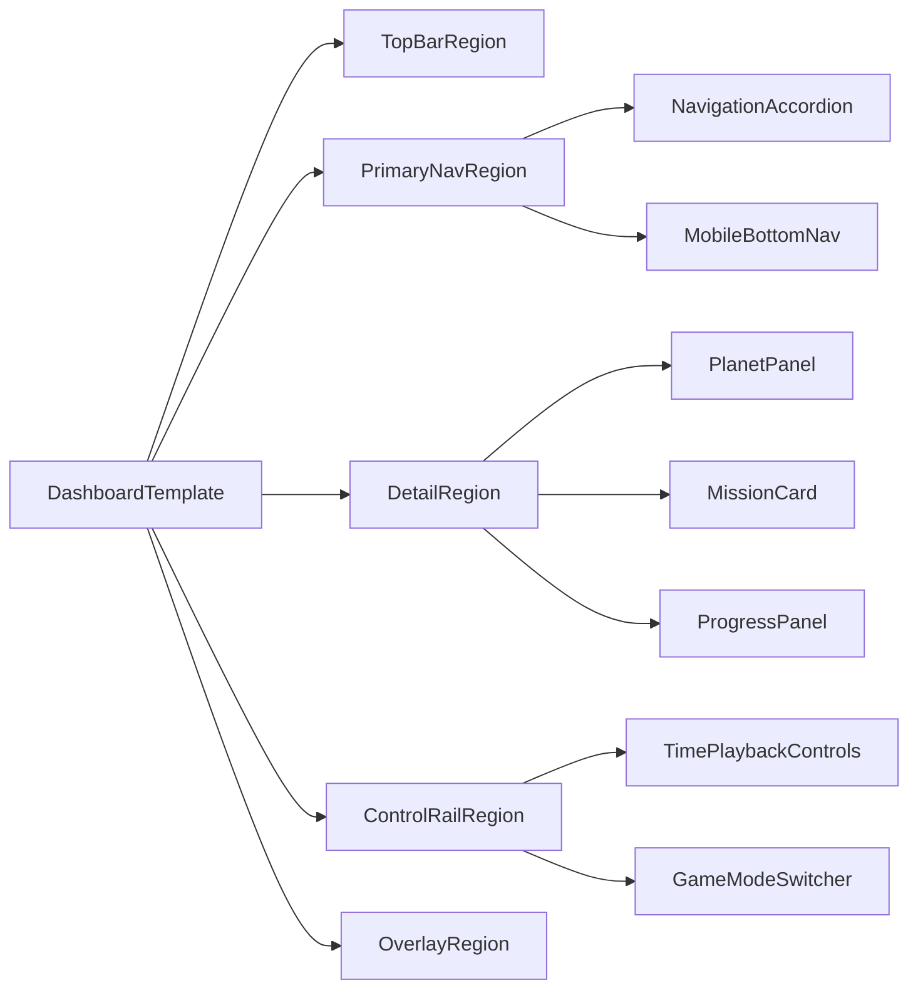

# HelioTrip Design System (Next)

This document defines the next-generation design system for HelioTrip using Refactoring UI constraints and Atomic Design architecture.

It is the source of truth for new and migrated dashboard UI work.
The existing `DESIGN_SYSTEM.md` remains a legacy reference while migration is in progress.

---

## 1) Design Principles

- Constrain choices to increase consistency and speed.
- Use named, functional tokens (never one-off values).
- Favor composition over custom component variants.
- Design mobile-first and progressively enhance for larger screens.
- Keep immersive space aesthetics while preserving readability and interaction clarity.

---

## 2) Color System (HSL, fixed tokens)

Use explicit HSL values. Do not use lighten/darken utilities or generated runtime transforms.

### 2.1 Space Dark (neutral surfaces + text contrast)

| Token                    | HSL           | Usage                 |
| ------------------------ | ------------- | --------------------- |
| `--color-space-dark-50`  | `220 30% 96%` | highest-contrast text |
| `--color-space-dark-100` | `223 25% 91%` | primary text          |
| `--color-space-dark-200` | `224 20% 82%` | secondary text        |
| `--color-space-dark-300` | `225 16% 68%` | muted text            |
| `--color-space-dark-400` | `226 14% 52%` | placeholders/dividers |
| `--color-space-dark-500` | `227 16% 38%` | disabled states       |
| `--color-space-dark-600` | `229 22% 23%` | elevated borders      |
| `--color-space-dark-700` | `230 30% 15%` | panel overlays        |
| `--color-space-dark-800` | `231 38% 10%` | app background        |
| `--color-space-dark-900` | `232 44% 6%`  | deepest backdrop      |

### 2.2 Nebula Primary (interactive brand color)

| Token                        | HSL            | Usage               |
| ---------------------------- | -------------- | ------------------- |
| `--color-nebula-primary-50`  | `214 100% 96%` | subtle highlights   |
| `--color-nebula-primary-100` | `217 100% 92%` | soft selected bg    |
| `--color-nebula-primary-200` | `221 96% 84%`  | chips and tags      |
| `--color-nebula-primary-300` | `226 92% 74%`  | hover accents       |
| `--color-nebula-primary-400` | `232 89% 66%`  | interactive default |
| `--color-nebula-primary-500` | `238 84% 60%`  | primary action      |
| `--color-nebula-primary-600` | `243 75% 52%`  | active focus        |
| `--color-nebula-primary-700` | `247 68% 45%`  | pressed state       |
| `--color-nebula-primary-800` | `249 61% 36%`  | dark surfaces       |
| `--color-nebula-primary-900` | `252 58% 28%`  | deep decorative     |

### 2.3 Star Accent (attention and active celestial highlights)

| Token                     | HSL            | Usage                     |
| ------------------------- | -------------- | ------------------------- |
| `--color-star-accent-100` | `197 100% 92%` | high-contrast accent text |
| `--color-star-accent-200` | `194 97% 84%`  | soft active states        |
| `--color-star-accent-300` | `191 93% 75%`  | badges/chips              |
| `--color-star-accent-400` | `188 90% 66%`  | hover accent              |
| `--color-star-accent-500` | `186 88% 56%`  | active accent             |
| `--color-star-accent-600` | `184 82% 47%`  | strong emphasis           |
| `--color-star-accent-700` | `183 75% 39%`  | pressed/selected          |
| `--color-star-accent-800` | `182 68% 31%`  | deep accent surface       |

### 2.4 Semantic Colors

#### Success

- `--color-success-100`: `153 79% 90%`
- `--color-success-200`: `153 72% 80%`
- `--color-success-300`: `154 66% 68%`
- `--color-success-400`: `155 63% 56%`
- `--color-success-500`: `156 64% 45%`
- `--color-success-600`: `157 67% 36%`
- `--color-success-700`: `159 70% 28%`
- `--color-success-800`: `161 73% 21%`

#### Warning

- `--color-warning-100`: `42 100% 90%`
- `--color-warning-200`: `41 98% 80%`
- `--color-warning-300`: `40 95% 69%`
- `--color-warning-400`: `39 93% 58%`
- `--color-warning-500`: `38 91% 50%`
- `--color-warning-600`: `35 89% 42%`
- `--color-warning-700`: `32 84% 34%`
- `--color-warning-800`: `30 79% 27%`

#### Danger

- `--color-danger-100`: `350 100% 93%`
- `--color-danger-200`: `350 93% 85%`
- `--color-danger-300`: `350 86% 75%`
- `--color-danger-400`: `350 80% 64%`
- `--color-danger-500`: `350 76% 54%`
- `--color-danger-600`: `350 72% 45%`
- `--color-danger-700`: `350 68% 36%`
- `--color-danger-800`: `350 64% 29%`

### 2.5 Usage Rules

- App background: `space-dark-800` or `space-dark-900`.
- Standard panel surface: `space-dark-700` with transparency, plus subtle blur.
- Primary action: `nebula-primary-500`, hover `nebula-primary-400`, active `nebula-primary-600`.
- Selected navigation/highlighted constellation: `star-accent-500`.
- Success/progress/achievement: `success` scale only.
- Never use raw hex in components; define tokens in global theme first.

---

## 3) Typography System

### 3.1 Type Scale

| Token            | Size | Typical Role                   |
| ---------------- | ---- | ------------------------------ |
| `--font-size-12` | 12px | captions, compact metadata     |
| `--font-size-14` | 14px | secondary body text            |
| `--font-size-16` | 16px | default body text              |
| `--font-size-18` | 18px | emphasized body / card heading |
| `--font-size-24` | 24px | section title                  |
| `--font-size-30` | 30px | page title                     |
| `--font-size-48` | 48px | hero numerals / splash heading |

### 3.2 Line-Height Pairs

| Size | Line height |
| ---- | ----------- |
| 12   | 16          |
| 14   | 20          |
| 16   | 24          |
| 18   | 24          |
| 24   | 32          |
| 30   | 36          |
| 48   | 52          |

### 3.3 Weight and Tracking

- Weights: `500` (UI labels), `600` (headings). Avoid `700+` in dashboard UI.
- Tracking:
  - neutral text: `0`
  - uppercase eyebrow labels: `0.2em`
- Numeric/telemetry values should use tabular numbers where available.

### 3.4 Baseline Alignment for Mixed Sizes

- When combining label + value pairs of different sizes:
  - align to baseline, not center.
  - use consistent line-height pairs from section 3.2.
  - avoid ad-hoc margin nudges; use a dedicated stack/row utility.

---

## 4) Spacing System (Non-linear)

| Token        | Value | Typical Usage             |
| ------------ | ----- | ------------------------- |
| `--space-1`  | 4px   | icon-label micro gap      |
| `--space-2`  | 8px   | compact controls          |
| `--space-3`  | 12px  | list row internals        |
| `--space-4`  | 16px  | default component padding |
| `--space-6`  | 24px  | panel section spacing     |
| `--space-8`  | 32px  | grouped dashboard regions |
| `--space-12` | 48px  | major layout separation   |
| `--space-16` | 64px  | page-level offsets        |

### Spacing Rules

- Small deltas at micro level, larger jumps at layout level.
- Prefer token steps over one-off values.
- Safe-area offsets may use calculated values, but internal component spacing must still use the token scale.

---

## 5) Surface, Radius, Elevation, and Interaction Tokens

### 5.1 Radius

- `--radius-sm`: 8px
- `--radius-md`: 12px
- `--radius-lg`: 16px
- `--radius-xl`: 24px
- `--radius-pill`: 999px

### 5.2 Elevation

- `--shadow-none`: none
- `--shadow-float`: use for toasts, dialogs, and temporary overlays only

### 5.3 Panel Surface Contract

Standard HUD panels should share one canonical surface contract:

- radius: `--radius-xl`
- border: subtle neutral border
- background: translucent `space-dark-700`
- blur: medium

Avoid introducing additional panel variants unless a new semantic role requires it.

---

## 6) Atomic Design Architecture

### 6.1 Folder Structure

- `src/components/atoms`
- `src/components/molecules`
- `src/components/organisms`
- `src/components/templates`

### 6.2 Current Component Mapping

#### Atoms

- `HudIconButton`
- `HudPanelToggleButton`
- `SolarSystemStartIcon`
- `VirtualJoystick`

#### Molecules

- `GameModeSwitcher`
- `FlightModeToggle`
- `LanguageToggle`
- `BottomSheet`
- `CollapsibleHudPanel`
- `MobileTimePill`
- `ConstellationViewControls`

#### Organisms

- `NavigationAccordion`
- `PlanetSelector`
- `ConstellationList`
- `TimePlaybackControls`
- `PlanetPanel`
- `MissionCard`
- `ProgressPanel`
- `AboutDialog`
- `MobileBottomNav`
- `FreeFlightMobileControls`

#### Templates

- `HUD` (main dashboard template today)
- `LoadingScreen`
- `SceneErrorBoundary`

### 6.3 Split Candidates

- `HUD`: split into shell + region templates.
- `PlanetPanel`: separate data shaping from presentation.
- `MissionCard`: split picker and active-mission detail views.
- `AboutDialog`: split trigger and content container.

### 6.4 Why some files remain in `src/components`

The migration is complete for the core atomic layers. A small set of files intentionally remains in `src/components` root because they are either cross-cutting helpers, transitional candidates, or test files rather than stable design-system building blocks.

- `ConstellationViewControls`: currently a context-specific control cluster used in multiple places, but not yet normalized as a generic molecule/organism contract.
- `MobileBottomNav`: tightly coupled to mobile sheet navigation semantics and game-mode state; kept at root until tablet/desktop navigation contracts are finalized.
- `AchievementToast`: global feedback overlay behavior (not a reusable content primitive yet).
- `FreeFlightHint`, `FreeFlightHelp`, `FreeFlightMobileControls`: mode-specific assistance and control surfaces that are feature-bound, not broadly reusable atomic primitives.
- `navigation.behavior.test.tsx`, `TimePlaybackControls.test.tsx`: tests stay colocated with component domain, not inside atomic layer folders.

#### Rule for future moves

Move a root-level component into `atoms`/`molecules`/`organisms` only when all conditions are true:
- clear reuse across at least two independent UI contexts,
- stable public props contract,
- visual semantics that align with design-token rules in this document.

Until then, keeping it at root is intentional and preferred over forcing an atomic placement.

---

## 7) Responsive Strategy (Mobile-First + Adaptive)

Define three layout tiers:

- `compact` (mobile default): single-column, focused actions, sheets/drawers.
- `medium` (tablet): column layout with master-detail, reduced modal dependence.
- `expanded` (desktop): persistent side regions and secondary information panels.

### 7.1 Mobile (compact) rules

- Start with the smallest useful feature set.
- Keep one primary task visible at a time.
- Use bottom navigation + task-specific sheets.
- Avoid persistent side chrome.

### 7.2 Tablet (medium) enhancements

- Introduce two-column patterns for browsing + detail.
- Convert simple lists into master-detail where context matters.
- Keep controls reachable without covering core content.

### 7.3 Desktop (expanded) enhancements

- Use sidebars/secondary panels for immersive context.
- Prevent over-stretching with content max-width constraints.
- Keep critical controls and contextual data visible concurrently.

---

## 8) Dashboard Migration Plan

### Phase 1 - Foundation

- Add this file as the new design-system source of truth.
- Define token names for use in Tailwind utilities and global CSS variables.
- Freeze new arbitrary styles in dashboard-facing components.

### Phase 2 - Template Extraction

- Refactor `src/components/HUD.tsx` into template shell regions without visual change:
  - `topBarRegion`
  - `primaryNavRegion`
  - `detailRegion`
  - `controlRailRegion`
  - `overlayRegion`

### Phase 3 - Atomic Re-homing

- Move components into atomic folders.
- Keep temporary compatibility exports to avoid breaking imports during transition.
- Validate that behavior is unchanged after each move.

### Phase 4 - Responsive Upgrade

- Introduce `useResponsiveLayout` (`compact`, `medium`, `expanded`) alongside existing mobile hook.
- Shift macro layout decisions to responsive tier logic.
- Implement tablet master-detail composition for navigation + planet details.

### Phase 5 - Visual Normalization

- Replace arbitrary text/spacing/color values with tokens in highest-impact order:
  1. panel surfaces and headers
  2. nav/list rows
  3. controls and overlays
  4. dialogs and sheets

### Validation Gates

- Visual parity checks on mobile and desktop before/after each phase.
- Tablet portrait/landscape verification after responsive tier introduction.
- Lint/type/tests after each migration phase.

---

## 9) Dashboard Composition Target

---

## 10) Implementation Guardrails

- Reuse existing components before creating new ones.
- Keep pointer events explicit in HUD overlays.
- Use Lucide icon sizing conventions already established in the project.
- Keep comments in code in English.
- Do not introduce unbounded width containers on desktop layouts.

